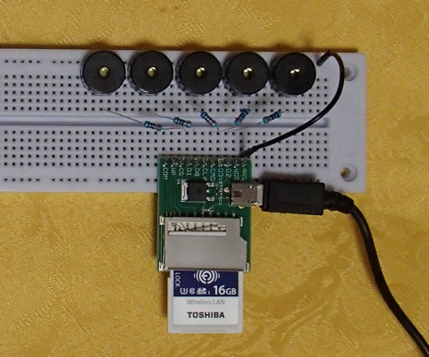

# Lua library for MMLdecode & player for FlashAir.  

これはFlashAirのPWM機能でMML(Music Macro Language)を演奏するためのライブラリです。  
FlashAir W-04のファームウェア v4.00.03以降で動作します。  
最大 5重和音（5チャンネル同時）演奏が可能です。  

## インストール方法  

    lib/SlibMML.lua  -- ライブラリ  
    sample.lua       -- 演奏サンプルプログラム  
上記をFlashAir内の好きな場所においてください  

## FlashAirと圧電サウンダのつなぎ方  

必要なチャンネル数の圧電サウンダを用意します。  
例えば、5チャンネルに対応する場合は、5個の圧電サウンダ(0ch～4ch)を用意します。  
各圧電サウンダの端子を抵抗を介してFlashAirの端子につなぎ、反対側の端子はGNDにつなぎます。  
抵抗値は 470～1kΩ程度が適当です。  

FlashAir(Pin#) | 圧電サウンダ | 備考
--- | --- | ---
CLK (5) |--- | Pull-down(10korm) to GND
CMD (2) |0ch |
DAT0(7) |1ch |
DAT1(8) |2ch |
DAT2(9) |3ch |
DAT3(1) |4ch |
VCC (4) |--- | 2.7～3.6V
VSS(3,6)|0,1,2,3,4ch | GND

　  
１個の圧電サウンダで２チャンネル再生に対応させる方法もあります。  
圧電サウンダの２つの端子を抵抗を介してFlashAirの端子にそれぞれつなぎます。  
抵抗値は 220～470Ω程度が適当です。  

FlashAir(Pin#) | 圧電サウンダ | 備考
--- | --- | ---
CLK (5) |--- | Pull-down(10korm) to GND
CMD (2) |0ch |
DAT0(7) |1ch |
DAT1(8) |--- |
DAT2(9) |--- |
DAT3(1) |--- |
VCC (4) |--- | 2.7～3.6V
VSS(3,6)|--- | GND

## 本ライブラリにおけるMMLの文法 (参考文献：Wikipedia から少しアレンジ）
大文字小文字の区別はありません。  
空白は無視されます。  

記号 | 説明
--- | --- 
 C D E F G A B | それぞれ、ドレミファソラシの音符。
 \# \+ | 音符の後につけて半音上げる。#と+は同じ意味。
 \- | 音符の後につけて半音下げる。
 R | 休符。
 数字 . | 音符や休符の後につけ、音の長さを表す。2=2分音符。.は付点で長さを1.5倍する。4.=付点4分音符。
 O | オクターブ指定。初期値は4。
 \> | 1オクターブ下げる。
 < | 1オクターブ上げる。
 ~ | 音符の前に置くと、その音を1オクターブ上げる。
 _ | 音符の前に置くと、その音を1オクターブ下げる。
 L | A～GやRの後に数字をつけないときの音の長さを指定。初期値は4。
 T | テンポを指定。たとえば「T120」なら120BPMで演奏する。初期値は120。
 N | 通常のオクターブ+CDEFGABではなく、一番下から数えた音の高さで直接指定する。 N0はO1C、N1はO1C+、N95はO8Bを表す。
 Q | 発音の長さを指定する。最大は「Q100」で100%。初期値は60。
 @ | 1～99で倍音の出方(音色）を指定する。初期値は50。
 , | チャンネル区切り。（チャンネルは 5つまで）

## SlibMML.lua の関数の説明  

関数 | 説明  
--- | ---  
SlibMML:PlayMML(mml) | **指定されたMML記述をPWM機能を使用して演奏します** **mml:** MML記述(上記およびサンプルコード参照)

## サンプルコード  

sample.lua          -- MMLを演奏します

## Licence  

[MIT](/LICENSE)  

## Author  

[GitHub/AoiSaya](https://github.com/AoiSaya)  
[Twitter ID @La_zlo](https://twitter.com/La_zlo)  
